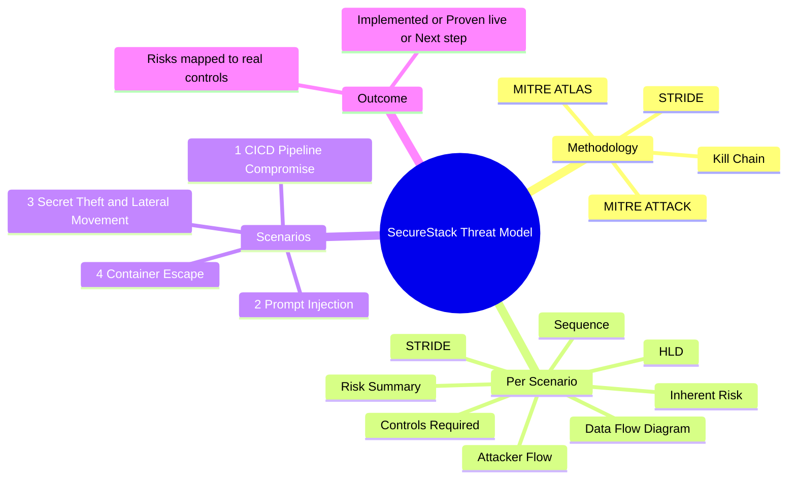

# SecureStack Threat Model

A threat-modelling exercise for the SecureStack platform and its showcase application, ai-vibecode-lab (MediTriage, an AI patient-triage API). This repository documents the attack scenarios, risk assessments, and the controls that mitigate them, mapped to the controls actually implemented and, where noted, proven live on AWS.

## Introduction

This threat model details runbook scenarios of attacks against SecureStack, a DevSecOps platform securing an AI healthcare application across the full lifecycle (build time, deploy time, and runtime). It covers the attacks most likely to be used against this system, spanning both initial access and post-compromise impact, so the defences can be assessed end to end.

## Scope

Four scenarios are modelled, covering the full attack lifecycle from initial access to impact:

1. CI/CD Pipeline Compromise - a software-supply-chain attack that injects malicious code through the pipeline (initial access).
2. Prompt Injection - an AI-specific attack that manipulates the model via adversarial input (initial access).
3. Secret Theft and Cloud Lateral Movement - an attacker with a foothold steals credentials and moves through the AWS account (post-compromise impact).
4. Container Escape and Runtime Compromise - an attacker with code execution in a pod attempts to break out to the host and cluster (post-compromise impact).

Scenarios 1 and 2 address how an attacker gets in; scenarios 3 and 4 address what they can do once in. Together they test whether a single compromise can be contained.

## Methodology

Each scenario is assessed against the cyber kill chain, mapped to MITRE ATT&CK (and MITRE ATLAS for the AI scenario), with STRIDE used for control-gap analysis. Each identified risk is mapped to a mitigation that exists in SecureStack, distinguishing controls that are implemented, proven live, or planned as next steps. This keeps the model honest: it documents the real security posture, not an aspirational one.

## System Under Assessment

- ai-vibecode-lab (MediTriage) - an AI patient-triage API (API container + llm-guard sidecar) on AWS EKS, owning its own infrastructure.
- SecureStack-platform - the reusable 13-stage security pipeline, policies, AI-BOM validator, and governance consumed by the app via workflow_call.
- Supporting AWS services: ECR, ArgoCD (GitOps), Secrets Manager + KMS, External Secrets Operator (IRSA), OpenSearch SIEM, CloudTrail, GuardDuty, a SOAR Lambda, Prometheus/Grafana, Kyverno, and Falco.

## Conclusion

Across all four scenarios, the inherent (pre-control) risk is predominantly High, driven by the sensitivity of healthcare data, the ability of a supply-chain compromise to act in the cloud account, the AI-native risk that a model cannot distinguish instructions from data, and the blast-radius danger of a single compromise cascading. With SecureStack's layered, defence-in-depth controls applied, the dominant risk paths are reduced to Low-to-Medium, because an attacker must defeat multiple independent controls rather than any single one.

## Overall Risk Overview

| Scenario | Primary Threat | Inherent Risk | Key Controls | Residual Risk |
| --- | --- | --- | --- | --- |
| 1. CI/CD Pipeline Compromise | Malicious code deployed via the supply chain | High | 13-stage gated pipeline, keyless OIDC, GitOps, IRSA, Kyverno, SIEM/SOAR | Low-Medium |
| 2. Prompt Injection | Model manipulation via adversarial input | High | llm-guard (fail-closed), AI-BOM ceilings, custom Semgrep rules, output scanning | Low-Medium |
| 3. Secret Theft and Lateral Movement | Credential theft and account-wide movement | High | IMDSv2, scoped IRSA, RBAC, scoped secrets, KMS, SOAR auto-disable | Low-Medium |
| 4. Container Escape | Breakout to the host and cluster | High | Pod hardening, Kyverno admission, PSS, Falco runtime detection, network policies | Low-Medium |

## Top Controls Required (consolidated)

- A merge-blocking 13-stage security pipeline (secret scanning, SAST, SCA, SBOM, IaC, policy, AI-BOM, DAST).
- Keyless OIDC authentication with least-privilege, short-lived roles; IRSA per-pod identity; IMDSv2 with hop limit.
- GitOps delivery (ArgoCD) so only reviewed, git-declared manifests deploy.
- Runtime AI guardrails (llm-guard, fail-closed) blocking prompt injection and scanning output.
- AI governance: AI-BOM data-classification ceilings and CLAUDE.md agent governance.
- Pod hardening (non-root, dropped capabilities, read-only filesystem) and Kyverno admission control.
- Scoped secrets access (ESO to two secret ARNs) with KMS CMK encryption.
- Runtime detection (Falco eBPF), zero-trust network policies, and a centralised SIEM (OpenSearch correlating CloudTrail, GuardDuty, app logs) with automated response (SOAR).

## Threat Modelling Process

## Repository Structure

Each of the four scenario folders contains nine files: a README (kill chain description), Attacker-Flow, Data-Flow-Diagram, HLD, Inherent-Risk-Assessment, a MITRE sequence (ATT&CK, with ATLAS for the AI scenario), STRIDE, Risk-Summary, and Controls-Required.

## Related Repositories

- SecureStack-platform - the security platform (pipeline, policies, governance): https://github.com/baks7101/SecureStack-platform
- ai-vibecode-lab - the AI application being protected: https://github.com/baks7101/ai-vibecode-lab
