# Kill Chain Attack Description: SecureStack - CI/CD Pipeline Compromise Scenario

## Stages of the Attack

### Origins

The attack targets the ai-vibecode-lab application (MediTriage, an AI patient-triage API) by abusing its CI/CD supply chain rather than attacking the running application directly. The adversary's goal is to inject malicious code or configuration into the pipeline so that it is deployed to the EKS cluster as a trusted, signed-off change, bypassing the runtime controls entirely. Because ai-vibecode-lab consumes a central, reusable security pipeline from the SecureStack platform repository, the attacker also considers whether compromising the platform would affect every consuming application at once.

### Reconnaissance

The attacker studies the public GitHub repositories, baks7101/ai-vibecode-lab and baks7101/SecureStack-platform, to understand the two-repository trust relationship. They enumerate the reusable workflow (full-security-scan.yml), the composite actions, the OIDC trust configuration, and the branch-protection rules. The objective is to find the weakest path to merging malicious code: an unprotected branch, an over-permissioned workflow, a misconfigured OIDC trust policy, or a dependency that can be poisoned.

### Weaponization

The attacker crafts a malicious payload designed to survive the pipeline. This could be a dependency with a typosquatted or poisoned version, a subtle code change that the scanners are not tuned to catch, a tampered Dockerfile, or a malicious edit to a shared policy or composite action in the platform repository. The payload is engineered to look like a legitimate change, for example an "experimental feature" or a "dependency upgrade".

### Delivery

The attacker delivers the payload by opening a pull request, or by abusing compromised developer or CI credentials. If branch protection or the required status checks are weak, the malicious change can be merged. If the central platform pipeline is targeted, a change merged to the platform's main branch is inherited immediately by every consuming application, because they reference the workflow at @main.

### Exploitation

During pipeline execution, the attacker attempts to have the malicious step run with the pipeline's AWS permissions. They target the OIDC-assumed role used by the pipeline, over-permissioned workflow tokens, or an injection point in a build step. The aim is to execute attacker-controlled commands inside the trusted CI runner, where secrets and cloud credentials are reachable.

### Installation

If the malicious code passes the gate and is deployed, it becomes a legitimate running workload on the EKS cluster, pulled from the trusted ECR registry. The attacker now has code executing inside the production environment under the guise of a normal, reviewed deployment, with no user interaction required.

### Command and Control

The deployed malicious workload establishes covert outbound communication, or exfiltrates data through a legitimate-looking channel. Because the workload was deployed through the trusted pipeline, it is not treated as anomalous, and the attacker can adjust behaviour without redeploying.

### Actions on Objectives

With a foothold established through the supply chain, the attacker pursues their goal: stealing the OpenAI key or other secrets from the vault, exfiltrating patient data (PII/PHI) processed by the triage API, poisoning the AI pipeline, or using the compromised workload as a pivot point to move laterally within the AWS account.

```mermaid
flowchart LR
    A[Reconnaissance] -->|Enumerate repos, workflow, OIDC trust| B[Weaponization]
    B -->|Craft poisoned dependency / tampered artifact| C[Delivery]
    C -->|Merge via weak branch protection or stolen creds| D[Exploitation]
    D -->|Execute in trusted CI runner with cloud creds| E[Installation]
    E -->|Deploy malicious workload to EKS via ECR| F[Command and Control]
    F -->|Establish covert outbound channel| G[Actions on Objectives]
    G -->|Exfiltrate secrets / PHI| G
    G -->|Pivot laterally in AWS account| G
```

