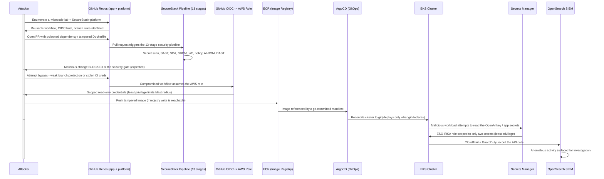

# Attacker Flow: CI/CD Pipeline Compromise

## Narrative

The attacker first maps the two-repository supply chain. Their primary delivery attempt, a malicious pull request, is designed to be caught by the pipeline, and in the normal case it is: the 13-stage gate blocks it. The attacker therefore pivots to bypass techniques (weak branch protection, stolen credentials, abusing the OIDC-assumed role).

Even on a successful bypass, defence in depth constrains the blast radius at every step: the OIDC role is scoped read-only, GitOps means only git-declared manifests deploy (not arbitrary attacker pushes), the External Secrets Operator's IRSA role can read only two specific secrets, and every AWS API call lands in CloudTrail and GuardDuty for the SIEM to surface. No single compromise grants the full objective.
