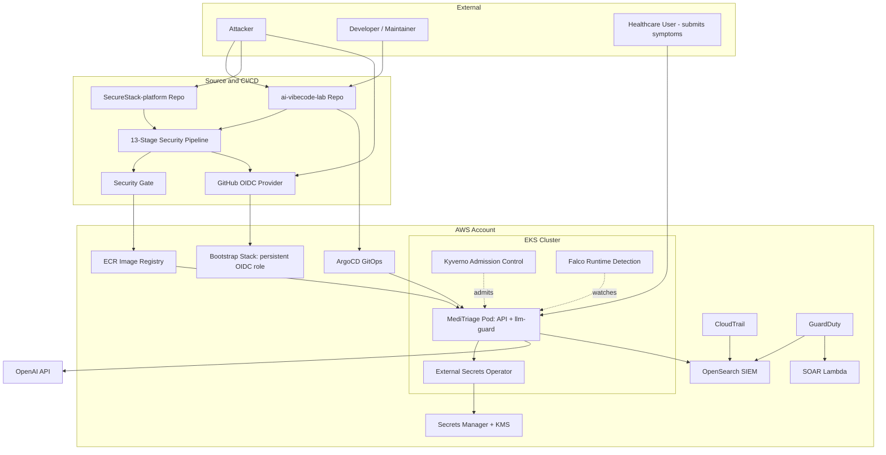

# High-Level Design: SecureStack (CI/CD Compromise view)

## Key Architectural Controls (relevant to this scenario)

- **Two-repository separation**: the security pipeline and policies live in the platform repo, owned centrally; the app consumes them via `workflow_call` and cannot weaken them.
- **13-stage pipeline + security gate**: blocks insecure code, poisoned dependencies, and misconfigurations before merge.
- **Keyless OIDC authentication**: the pipeline assumes a short-lived, scoped AWS role; no long-lived keys exist to steal.
- **Bootstrap stack**: the persistent CI identity role is isolated in its own Terraform state, separate from the ephemeral cluster.
- **GitOps (ArgoCD)**: git is the single source of truth; only declared manifests deploy, and drift is auto-reverted.
- **Admission + runtime**: Kyverno gates what can start; Falco watches what runs.
- **Keyless secrets**: Secrets Manager + ESO via a tightly scoped IRSA role.
- **Centralised SIEM + SOAR**: CloudTrail, GuardDuty, and app logs converge in OpenSearch; GuardDuty findings trigger automated response.
