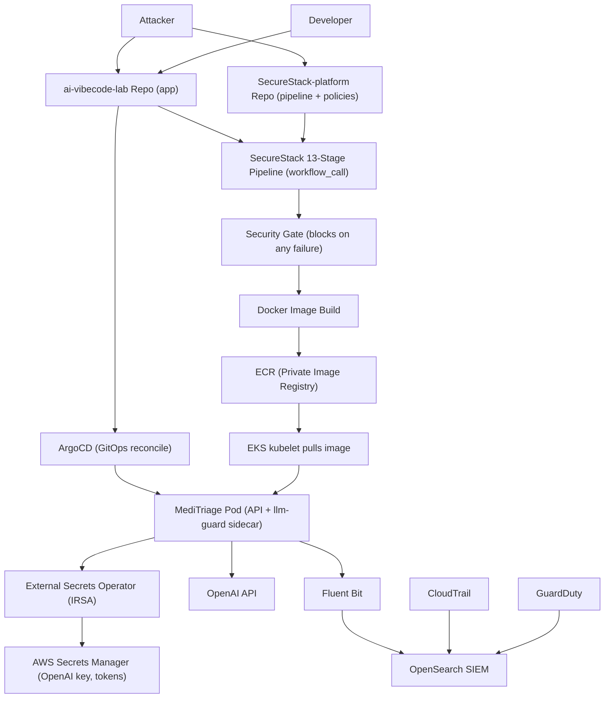

# Data Flow Diagram: CI/CD Pipeline Compromise

## Trust Boundaries

| Boundary | Separates | Why it matters |
| --- | --- | --- |
| Repo boundary | App repo vs platform repo | The app team consumes the pipeline but cannot alter the security controls; the security team owns them centrally. |
| CI boundary | GitHub Actions runner vs AWS account | The runner authenticates to AWS via short-lived OIDC credentials, not long-lived keys. A compromised runner gets a scoped, read-only role. |
| Registry boundary | CI build vs the cluster | The cluster pulls only from the private ECR; images are not pulled from arbitrary sources. |
| GitOps boundary | Git (desired state) vs the live cluster | ArgoCD deploys only what is declared in git. An attacker who pushes an image cannot deploy it without a reviewed git commit referencing it. |
| Secrets boundary | The vault vs the workload | Secrets never touch git. ESO reads them via an IRSA role scoped to exactly two secrets; no human handles the values. |
| Account boundary | The workload vs the wider AWS account | IRSA per-pod identity and IMDSv2 prevent a compromised pod from assuming broad node or account permissions. |

## Sensitive Data in Scope

- Patient-submitted symptoms (potential PII / PHI) processed by the triage API.
- The OpenAI API key and application secrets held in Secrets Manager.
- The pipeline's OIDC-assumed AWS credentials.
- Stored triage logs (held in memory for the lab; would be a database in production).
