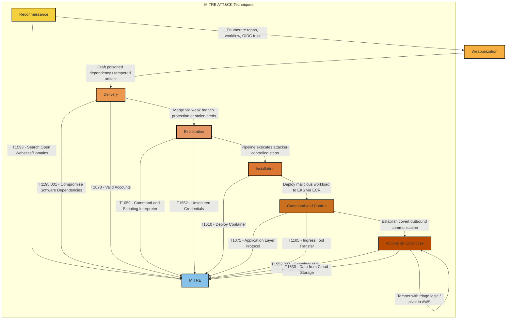

# MITRE ATT&CK Sequence Summary: CI/CD Pipeline Compromise

## Technique Mapping

| Kill Chain Stage | MITRE Technique | Application to SecureStack |
| --- | --- | --- |
| Reconnaissance | T1593 Search Open Websites/Domains | Reading the public app and platform repos to map the pipeline and OIDC trust |
| Delivery | T1195.001 Compromise Software Dependencies | Poisoning a dependency the app pulls in |
| Delivery | T1078 Valid Accounts | Using stolen developer or CI credentials to merge |
| Exploitation | T1059 Command and Scripting Interpreter | Running attacker commands inside the CI runner |
| Exploitation | T1552 Unsecured Credentials | Harvesting secrets or the OIDC role from the runner |
| Installation | T1610 Deploy Container | Deploying a tampered image as a trusted workload |
| Command and Control | T1071 / T1105 | Covert outbound comms and tool transfer from the workload |
| Actions on Objectives | T1552.007 / T1530 | Stealing cloud secrets and patient data from the environment |
