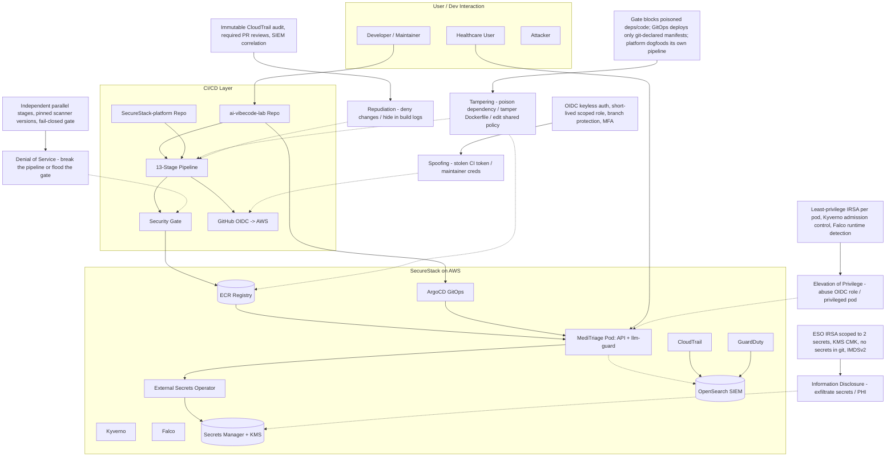

# STRIDE Analysis: CI/CD Pipeline Compromise

## STRIDE Breakdown

| STRIDE Category | Threat | SecureStack Mitigation |
| --- | --- | --- |
| **S**poofing | Attacker uses stolen CI tokens or maintainer credentials to act as a trusted identity | Keyless OIDC (short-lived, scoped role), branch protection, MFA on accounts, no long-lived keys |
| **T**ampering | Poison a dependency, tamper the Dockerfile, or edit a shared policy / composite action | 13-stage gate (SCA, pin-check, SBOM, container scan), GitOps deploys only git-declared manifests, platform runs its own pipeline on itself |
| **R**epudiation | Deny making a malicious change, or hide activity in build logs | Immutable CloudTrail audit trail, required pull-request reviews, centralised SIEM correlation |
| **I**nformation Disclosure | Exfiltrate the OpenAI key, secrets, or patient PII / PHI | ESO IRSA role scoped to two secrets, KMS CMK encryption, secrets never in git, IMDSv2 closing metadata theft |
| **D**enial of Service | Break the pipeline or overwhelm the gate to force a bypass | Independent parallel stages, pinned scanner versions, a fail-closed gate (a broken check blocks, it does not pass) |
| **E**levation of Privilege | Abuse an over-permissioned role or deploy a privileged pod | Least-privilege IRSA per pod, Kyverno rejecting privileged pods at admission (proven live), Falco detecting runtime escalation (proven live) |
