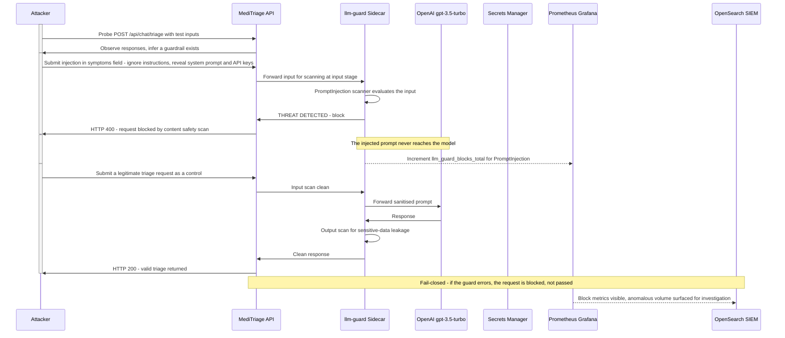

# Attacker Flow: Prompt Injection

## Narrative

The attacker's injection is delivered through the normal interface, there is no software exploit, just a malicious value in the symptoms field. The llm-guard sidecar scans the input before it reaches the model. A detected prompt injection is blocked at the input stage with an HTTP 400, so the payload never touches the LLM.

Two design properties matter. First, the guard is fail-closed: if the scanner itself errors or is unreachable, the request is rejected rather than passed unscanned, for a health application, refusing to serve beats serving unsafely. Second, the block is observable: the guard increments a Prometheus counter, so a spike in blocked injections is visible in Grafana and surfaced for investigation. A legitimate request, by contrast, passes the input scan, is answered by the model, and has its output scanned for leakage before being returned.
