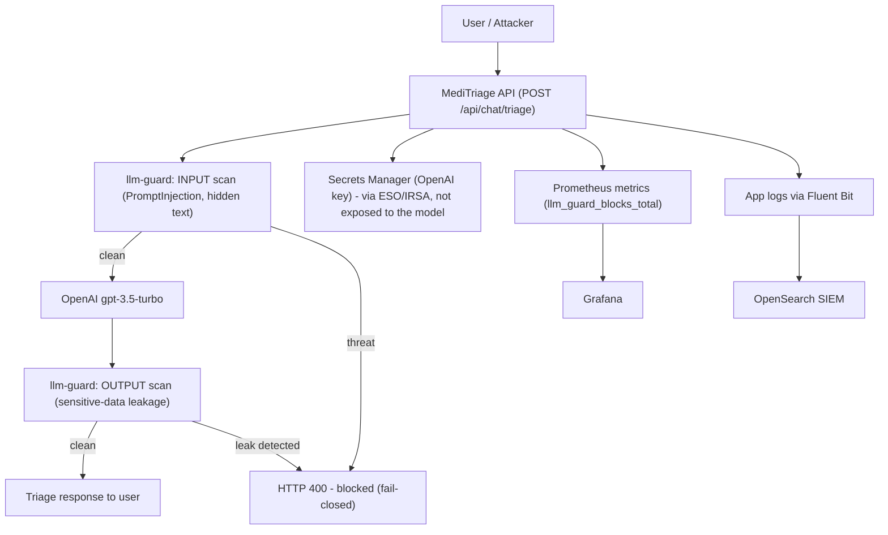

# Data Flow Diagram: Prompt Injection

## Trust Boundaries

| Boundary | Separates | Why it matters |
| --- | --- | --- |
| User input boundary | Untrusted user input vs the LLM prompt | User-supplied symptoms are untrusted and must be scanned before reaching the model. The model cannot distinguish instructions from data on its own. |
| Guard boundary (input) | The request vs the model | The llm-guard input scan is the primary control: a detected injection is blocked before the model ever sees it. |
| Guard boundary (output) | The model vs the user | The output scan checks the model's response for sensitive-data leakage before it is returned. |
| Secrets boundary | The OpenAI key vs the prompt context | The key authenticates the API call but is not placed into the prompt, so it cannot be leaked by the model even on a successful injection. |
| Fail-closed boundary | Guard availability vs request handling | If the guard is unavailable or errors, the request is rejected, not passed unscanned. |

## Sensitive Data in Scope

- The system prompt and application configuration (target of disclosure attacks).
- The OpenAI API key and application secrets (target of extraction; kept out of prompt context).
- Patient-submitted symptoms and any triage data the model processes (PII / PHI).
- The model's output, which must be treated as untrusted until scanned (insecure output handling).
