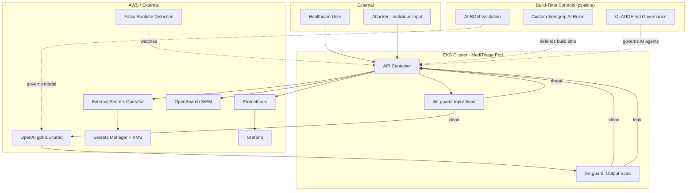

# High-Level Design: SecureStack (Prompt Injection view)

## Defence in Depth for Prompt Injection

Prompt injection is defended at all three layers, so a single bypass does not grant the objective:

- **Build time**: custom Semgrep rules flag injection-prone code patterns (for example, gluing raw user input into a prompt, or calling eval on model output). The AI-BOM validator governs which models are even permitted and for what data classification. The CLAUDE.md check governs AI coding agents.
- **Runtime (primary)**: the llm-guard sidecar scans input for injection before the model sees it (blocking at HTTP 400), and scans output for sensitive-data leakage before returning it. The guard is fail-closed.
- **Detection and response**: blocked-injection metrics are visible in Grafana; Falco watches for any runtime anomaly if a coupled attack reached code execution; the SIEM correlates activity.

## Key Design Properties

- The model cannot distinguish trusted instructions from untrusted user data, so input must be treated as hostile and scanned.
- The OpenAI key is used to authenticate the API call but is not placed in the prompt context, limiting what a successful injection can leak.
- Fail-closed design: a broken or unavailable guard blocks requests rather than silently disabling the control.
