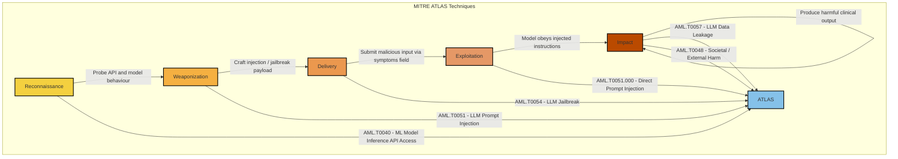

# MITRE ATLAS Sequence Summary: Prompt Injection

For AI-specific attacks, the appropriate framework is MITRE ATLAS (Adversarial Threat Landscape for Artificial-Intelligence Systems), the AI-focused companion to MITRE ATT&CK. The kill-chain stages below are mapped to ATLAS tactics and techniques, with the equivalent OWASP LLM Top 10 reference.

## Technique Mapping

| Kill Chain Stage | MITRE ATLAS Technique | OWASP LLM | Application to SecureStack |
| --- | --- | --- | --- |
| Reconnaissance | AML.T0040 ML Model Inference API Access | - | Probing the public triage API to learn model behaviour |
| Weaponization | AML.T0051 LLM Prompt Injection | LLM01 | Crafting instruction-override and jailbreak payloads |
| Delivery | AML.T0054 LLM Jailbreak | LLM01 | Submitting the payload through the symptoms field |
| Exploitation | AML.T0051.000 Direct Prompt Injection | LLM01 | The model obeys injected instructions (if ungated) |
| Impact | AML.T0057 LLM Data Leakage | LLM06 | Leaking the system prompt, secrets, or patient data |
| Impact | AML.T0048 External Harm | LLM02 | Manipulated clinical output causing patient harm |

## Note

Where a prompt injection is coupled with insecure output handling (for example, the model's output is passed to a dangerous sink such as eval), the chain extends beyond the AI layer into traditional ATT&CK techniques (T1059 Command and Scripting Interpreter), which is why insecure output handling is treated as a severe, coupled risk rather than a purely AI-layer concern.
