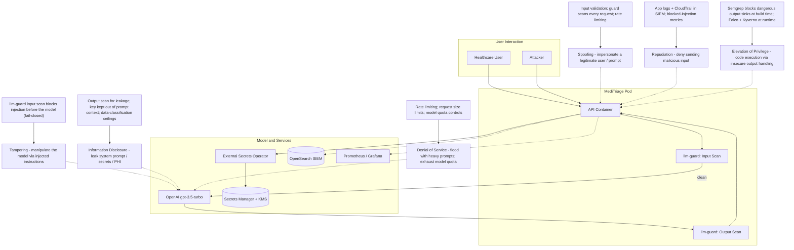

# STRIDE Analysis: Prompt Injection

## STRIDE Breakdown

| STRIDE Category | Threat | SecureStack Mitigation |
| --- | --- | --- |
| **S**poofing | Attacker submits malicious input disguised as a legitimate patient request | Every request is scanned by the guard regardless of source; input validation; rate limiting on the endpoint |
| **T**ampering | Attacker manipulates the model's behaviour via injected instructions | llm-guard input scan detects and blocks prompt injection before the model (proven live); fail-closed |
| **R**epudiation | Attacker denies submitting the malicious input | Application logs and CloudTrail feed the OpenSearch SIEM; blocked-injection metrics provide an audit trail |
| **I**nformation Disclosure | Model leaks its system prompt, the API key, or patient data | Output scan checks for leakage; the OpenAI key is never placed in the prompt context; AI-BOM data-classification ceilings |
| **D**enial of Service | Attacker floods the API with heavy prompts to exhaust model quota or availability | Rate limiting, request-size limits, and model quota controls (operational hardening) |
| **E**levation of Privilege | Insecure output handling (e.g. eval of model output) leads to code execution | Custom Semgrep rule blocks dangerous sinks at build time; Falco and Kyverno constrain runtime; least-privilege IRSA |
