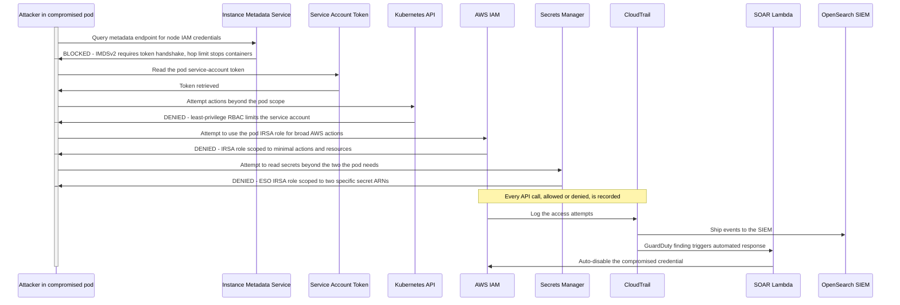

# Attacker Flow: Secret Theft and Cloud Lateral Movement

## Narrative

This scenario begins where others end: the attacker already has a foothold in a pod. The defence is about containment, ensuring one compromised workload cannot cascade into full account compromise.

Each escalation path is blocked by a specific control. The instance metadata attack, the technique behind the Capital One breach, is stopped by IMDSv2 and a hop limit that prevents containers reaching the endpoint. The Kubernetes API is constrained by least-privilege RBAC. The pod's cloud identity is a tightly scoped IRSA role, not a broad node role, so it cannot act widely in AWS. The secrets operator can read only the two specific secrets the app needs. And critically, every attempt, allowed or denied, is recorded in CloudTrail, surfaced in the SIEM, and a GuardDuty finding triggers the SOAR Lambda to auto-disable the compromised credential. The blast radius of a single pod compromise is deliberately tiny.
