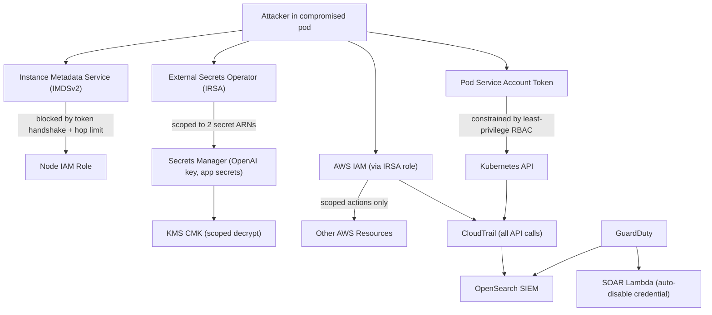

# Data Flow Diagram: Secret Theft and Cloud Lateral Movement

## Trust Boundaries

| Boundary | Separates | Why it matters |
| --- | --- | --- |
| Pod to node boundary | A compromised container vs the node's IAM credentials | IMDSv2 and a hop limit stop a container from stealing the node role, closing the Capital One attack path. |
| Pod identity boundary | The pod's IRSA role vs broad cloud access | The pod has a minimal, scoped IRSA identity, not the node role, so it cannot act widely in AWS. |
| Kubernetes RBAC boundary | The service account vs the cluster | Least-privilege RBAC limits what the pod's token can do against the Kubernetes API. |
| Secrets boundary | The workload vs all secrets | The ESO role can read only two specific secret ARNs; it cannot enumerate or read others. |
| Encryption boundary | Secret ciphertext vs plaintext | KMS CMK with scoped decrypt means even reading a secret requires permission to use the specific key. |
| Audit boundary | Attacker actions vs the record of them | Every API call, allowed or denied, is logged in CloudTrail and cannot be silently erased. |

## Sensitive Data in Scope

- The node IAM role credentials (target of the IMDS attack).
- The OpenAI API key and application secrets in Secrets Manager.
- The pod service-account token and its RBAC permissions.
- Patient data (PII / PHI) and other resources in the AWS account.
- CloudTrail logs (target of anti-forensics / log tampering).
