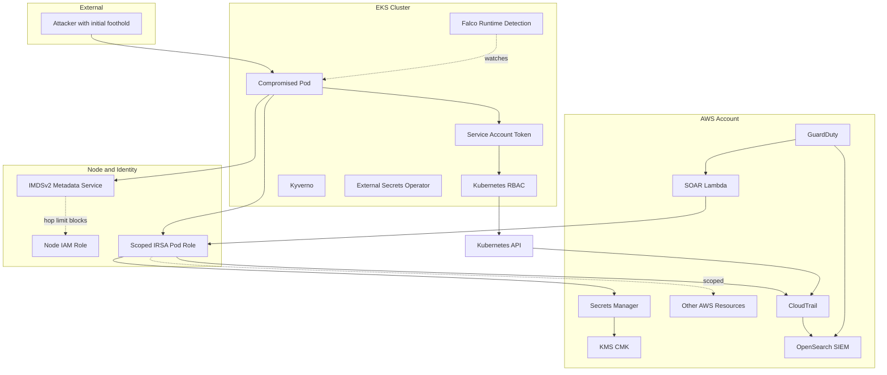

# High-Level Design: SecureStack (Secret Theft and Lateral Movement view)

## Key Architectural Controls (relevant to this scenario)

- **IMDSv2 with hop limit**: prevents a container from querying the metadata service to steal the node IAM role (closes the Capital One attack path).
- **Scoped IRSA per pod**: each pod has a minimal cloud identity bound to its service account, not the broad node role, so a compromised pod cannot act widely in AWS.
- **Least-privilege Kubernetes RBAC**: the service-account token can perform only narrowly defined actions against the Kubernetes API.
- **Scoped secrets access**: the External Secrets Operator role can read only two specific secret ARNs; it cannot enumerate or read others.
- **KMS CMK with scoped decrypt**: reading a secret also requires permission to use the specific encryption key.
- **Immutable audit and automated response**: every API call is logged in CloudTrail and surfaced in the OpenSearch SIEM; GuardDuty findings trigger a SOAR Lambda that auto-disables the compromised credential.
- **Runtime detection**: Falco watches for the anomalous syscalls associated with credential theft and enumeration.
