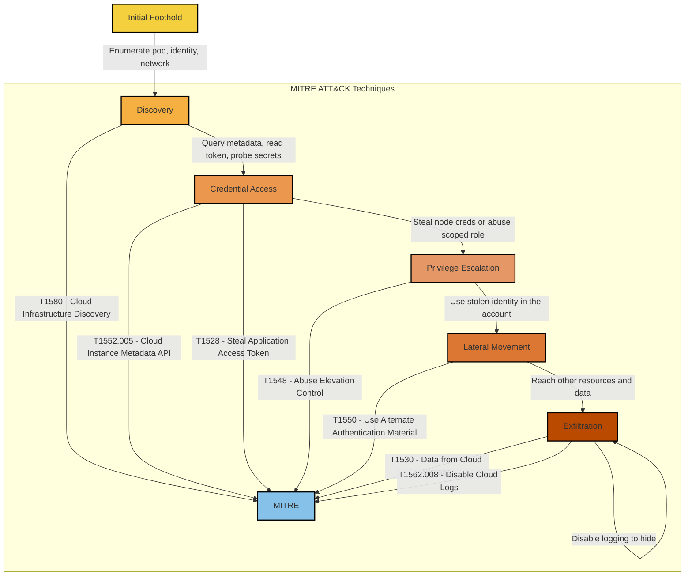

# MITRE ATT&CK Sequence Summary: Secret Theft and Cloud Lateral Movement

## Technique Mapping

| Kill Chain Stage | MITRE Technique | Application to SecureStack |
| --- | --- | --- |
| Discovery | T1580 Cloud Infrastructure Discovery | Enumerating what the compromised pod can see and reach |
| Credential Access | T1552.005 Cloud Instance Metadata API | Querying IMDS to steal node credentials (blocked by IMDSv2) |
| Credential Access | T1528 Steal Application Access Token | Reading the pod service-account token |
| Privilege Escalation | T1548 Abuse Elevation Control Mechanism | Attempting to act beyond the pod's scoped identity |
| Lateral Movement | T1550 Use Alternate Authentication Material | Using stolen credentials to move through the account |
| Exfiltration | T1530 Data from Cloud Storage | Reading patient data and secrets from AWS |
| Exfiltration | T1562.008 Disable Cloud Logs | Attempting to disable CloudTrail to cover tracks |
