# Kill Chain Attack Description: SecureStack - Secret Theft and Cloud Lateral Movement Scenario

## Stages of the Attack

### Origins

This scenario assumes the attacker has already gained an initial foothold, for example a compromised pod, a leaked credential, or code execution inside a container, and now attempts to escalate. Their objective is to steal secrets (the OpenAI key, database or application credentials), assume cloud identities, and move laterally through the AWS account to reach high-value data or establish persistence. This is the "what happens after initial access" scenario, and it tests whether a single compromise can be contained or whether it cascades into full account compromise.

### Reconnaissance

From inside the compromised workload, the attacker enumerates what the pod can see and do: environment variables, mounted secrets, the pod's service-account token, reachable internal services, and the cloud metadata endpoint. They probe for over-permissioned identities and misconfigurations that would let them escalate beyond the single pod.

### Weaponization

The attacker prepares to abuse legitimate cloud and Kubernetes mechanisms rather than deploy malware. This includes attempting to use the pod's IAM identity, querying the instance metadata service for node credentials, reading Kubernetes secrets, or using the service-account token to call the Kubernetes API.

### Delivery

The attack is delivered from within the trusted environment, using the pod's own identity and network position. There is no external payload; the attacker leverages the access they already have.

### Exploitation

The attacker attempts the classic escalation paths: querying the instance metadata service (IMDS) to steal the node's IAM role credentials (the technique behind the Capital One breach), reading secrets the pod can access, or abusing an over-permissioned IRSA role to call AWS APIs beyond the pod's intended scope.

### Installation

If escalation succeeds, the attacker establishes persistence using the stolen identity, for example creating new credentials, modifying IAM policies, or deploying a persistence mechanism in the account. The stolen identity makes their activity look legitimate.

### Command and Control

The attacker uses the stolen cloud credentials to operate through legitimate AWS APIs, which blends in with normal account activity and is harder to detect than external C2 traffic.

### Actions on Objectives

With escalated access, the attacker exfiltrates the OpenAI key and application secrets, reads patient data (PII / PHI) from storage, enumerates and accesses other resources in the account, and attempts to disable logging or monitoring to cover their tracks.

```mermaid
flowchart LR
    A[Reconnaissance] -->|Enumerate pod identity, secrets, metadata, network| B[Weaponization]
    B -->|Prepare to abuse IAM, IMDS, service-account token| C[Delivery]
    C -->|Operate from inside the trusted workload| D[Exploitation]
    D -->|Steal node creds via IMDS or abuse over-permissioned role| E[Installation]
    E -->|Establish persistence with stolen identity| F[Command and Control]
    F -->|Operate via legitimate AWS APIs| G[Actions on Objectives]
    G -->|Exfiltrate secrets and PHI| G
    G -->|Enumerate account, disable logging| G
```

