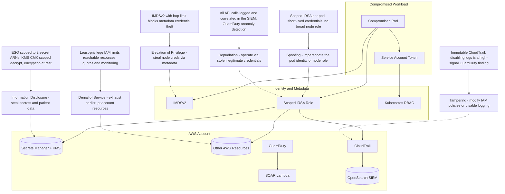

# STRIDE Analysis: Secret Theft and Cloud Lateral Movement

## STRIDE Breakdown

| STRIDE Category | Threat | SecureStack Mitigation |
| --- | --- | --- |
| **S**poofing | Impersonate the pod's identity or assume the node IAM role | Scoped IRSA per pod with short-lived credentials; no reliance on a broad node role |
| **T**ampering | Modify IAM policies or disable CloudTrail to hide activity | Immutable audit trail; disabling logs is itself a high-signal GuardDuty finding |
| **R**epudiation | Operate using stolen legitimate credentials to avoid attribution | Every API call logged in CloudTrail and correlated in the SIEM; GuardDuty flags anomalous use |
| **I**nformation Disclosure | Steal the OpenAI key, application secrets, or patient data | ESO scoped to two secret ARNs, KMS CMK scoped decrypt, encryption at rest |
| **D**enial of Service | Exhaust or disrupt account resources with stolen access | Least-privilege IAM limits reachable resources; quotas and monitoring |
| **E**levation of Privilege | Steal the node IAM role via the metadata service | IMDSv2 with a hop limit prevents containers reaching the metadata endpoint |
