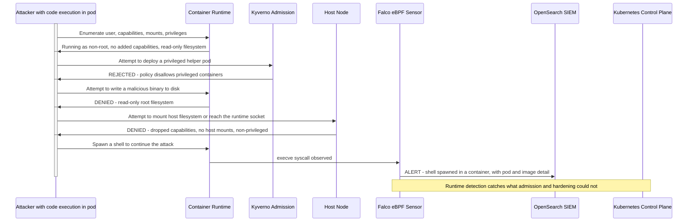

# Attacker Flow: Container Escape and Runtime Compromise

## Narrative

This scenario begins with the attacker already executing code inside a container. The defence is layered to make escape as hard as possible and to detect it if attempted.

Pod hardening removes the tools an attacker needs: the container runs as a non-root user, has its Linux capabilities dropped, and has a read-only root filesystem, so writing a malicious binary fails. Kyverno admission control prevents the attacker from deploying a privileged helper pod to escalate. Attempts to mount the host filesystem or reach the container runtime socket fail because the pod is non-privileged with no host mounts. And when the attacker spawns a shell to continue, Falco, watching kernel syscalls via eBPF, catches the execve immediately and alerts with full pod and image context. Admission control and hardening raise the bar; Falco catches what gets through.
