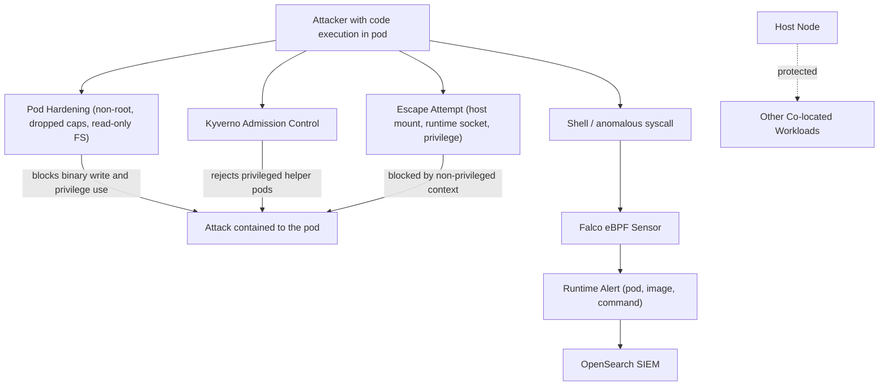

# Data Flow Diagram: Container Escape and Runtime Compromise

## Trust Boundaries

| Boundary | Separates | Why it matters |
| --- | --- | --- |
| Container to node boundary | A compromised container vs the host node | Pod hardening and a non-privileged context prevent breakout, so code execution stays inside the pod. |
| Privilege boundary | What the container can do vs host-level power | Dropped Linux capabilities and non-root execution remove the privileges needed to escape. |
| Filesystem boundary | The container vs persistent/host storage | A read-only root filesystem stops the attacker writing malware; no host mounts stop host access. |
| Admission boundary | What an attacker can newly deploy vs what is allowed | Kyverno rejects privileged or non-compliant pods an attacker might use to escalate. |
| Workload isolation boundary | One pod vs others on the same node | Containing the attack to one pod protects the many other workloads sharing the node. |
| Detection boundary | Silent compromise vs observed activity | Falco observes kernel syscalls, so a breakout attempt or shell is detected even if other controls are bypassed. |

## Sensitive Data in Scope

- The host node and the container runtime (target of the escape).
- Secrets and data belonging to other workloads co-located on the node.
- The Kubernetes control plane and other nodes (lateral targets).
- Patient data (PII / PHI) processed by any workload on the node.
