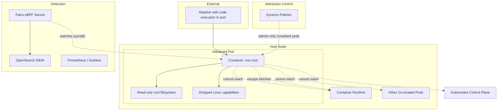

# High-Level Design: SecureStack (Container Escape view)

## Key Architectural Controls (relevant to this scenario)

- **Pod hardening**: containers run as a non-root user, with Linux capabilities dropped and a read-only root filesystem, removing the primitives an attacker needs to escape or persist.
- **Kyverno admission control**: rejects privileged containers, root execution, host-path mounts, and unapproved images, so an attacker cannot deploy an escalation helper (proven live).
- **Pod Security Standards**: baseline/restricted enforcement as a second, platform-level admission layer (defence in depth with Kyverno).
- **Falco runtime detection**: watches kernel syscalls via eBPF and alerts on escape-indicative behaviour such as a shell spawned in a container (proven live).
- **Network policies**: zero-trust segmentation limits what a compromised pod can reach across the cluster.
- **Centralised SIEM**: Falco and application signals are correlated for investigation.
