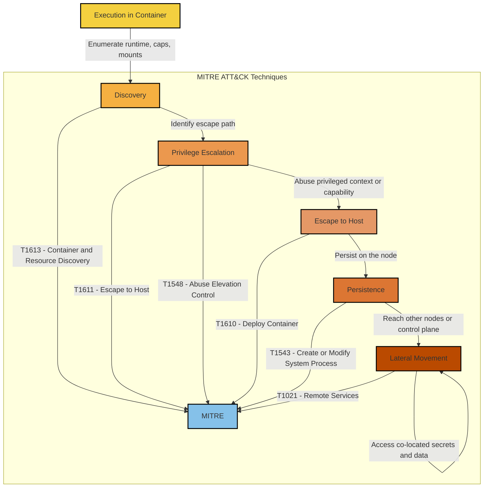

# MITRE ATT&CK Sequence Summary: Container Escape and Runtime Compromise

## Technique Mapping

| Kill Chain Stage | MITRE Technique | Application to SecureStack |
| --- | --- | --- |
| Discovery | T1613 Container and Resource Discovery | Enumerating the container runtime, capabilities, and mounts |
| Privilege Escalation | T1611 Escape to Host | Attempting to break out of the container to the node |
| Privilege Escalation | T1548 Abuse Elevation Control Mechanism | Abusing a privileged context or capability |
| Escape | T1610 Deploy Container | Deploying a privileged helper container (blocked by Kyverno) |
| Persistence | T1543 Create or Modify System Process | Installing a backdoor process on the node |
| Lateral Movement | T1021 Remote Services | Reaching other nodes or the control plane |
