# Kill Chain Attack Description: SecureStack - Container Escape and Runtime Compromise Scenario

## Stages of the Attack

### Origins

This scenario assumes the attacker has achieved code execution inside a running container, for example through an application vulnerability or a dependency flaw, and now attempts to break out of the container to compromise the underlying node and, from there, the wider cluster. Container escape is one of the most serious outcomes in a Kubernetes environment, because the node hosts many other workloads: a successful escape turns a single compromised application into control of the host and potentially the whole cluster. The objective is to test whether the container and cluster are hardened enough to contain code execution to the single pod.

### Reconnaissance

From inside the container, the attacker enumerates the runtime environment: the user they are running as, the Linux capabilities available, whether the root filesystem is writable, whether the container is privileged, what is mounted, and whether the host filesystem or Docker socket is reachable. They look for the misconfigurations that make escape possible.

### Weaponization

The attacker prepares escape techniques suited to what they found: abusing a privileged container, exploiting an over-permissive capability such as CAP_SYS_ADMIN, mounting the host filesystem, accessing the container runtime socket, or exploiting a kernel vulnerability. They may also attempt to write a malicious binary or establish a reverse shell.

### Delivery

The attack is delivered from within the compromised container using the access already obtained. There is no new external payload; the attacker leverages their code execution to attempt the breakout.

### Exploitation

The attacker executes the escape: spawning a shell, attempting to gain additional privileges, mounting host paths, or abusing a privileged context. In a hardened environment these attempts fail or are blocked; in an unhardened one they succeed and the attacker reaches the node.

### Installation

If escape succeeds, the attacker installs persistence on the node, for example a malicious process, a cron job, or a backdoor, and can now affect every workload scheduled on that node.

### Command and Control

From the compromised node, the attacker establishes command and control, and may attempt to reach the Kubernetes control plane or other nodes to expand their foothold across the cluster.

### Actions on Objectives

With node or cluster control, the attacker reads secrets and data from co-located workloads, tampers with other applications, mines resources, or uses the position to pivot toward the wider AWS account. In a healthcare context, this risks exposure of patient data processed by any workload on the node.

```mermaid
flowchart LR
    A[Reconnaissance] -->|Enumerate user, capabilities, mounts, privileges| B[Weaponization]
    B -->|Prepare escape - privileged, caps, host mount, runtime socket| C[Delivery]
    C -->|Operate from inside the compromised container| D[Exploitation]
    D -->|Attempt breakout - shell, privilege gain, host access| E[Installation]
    E -->|Persist on the node| F[Command and Control]
    F -->|Reach other nodes or the control plane| G[Actions on Objectives]
    G -->|Read co-located secrets and data| G
    G -->|Tamper with other workloads or pivot| G
```

