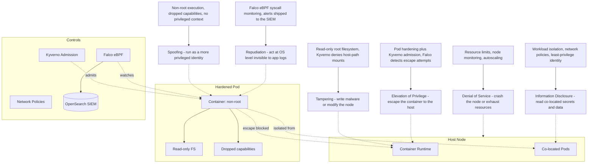

# STRIDE Analysis: Container Escape and Runtime Compromise

## STRIDE Breakdown

| STRIDE Category | Threat | SecureStack Mitigation |
| --- | --- | --- |
| **S**poofing | Run as a more privileged identity to aid escape | Non-root execution, dropped capabilities, no privileged context |
| **T**ampering | Write malware to disk or modify the node | Read-only root filesystem; Kyverno denies host-path mounts |
| **R**epudiation | Act at the OS level, invisible to application logs | Falco eBPF syscall monitoring with alerts shipped to the SIEM |
| **I**nformation Disclosure | Read secrets and data of co-located workloads | Workload isolation, zero-trust network policies, least-privilege identity |
| **D**enial of Service | Crash the node or exhaust its resources | Resource limits, node monitoring, autoscaling |
| **E**levation of Privilege | Escape the container to gain host-level control | Pod hardening plus Kyverno admission control; Falco detects escape attempts |
